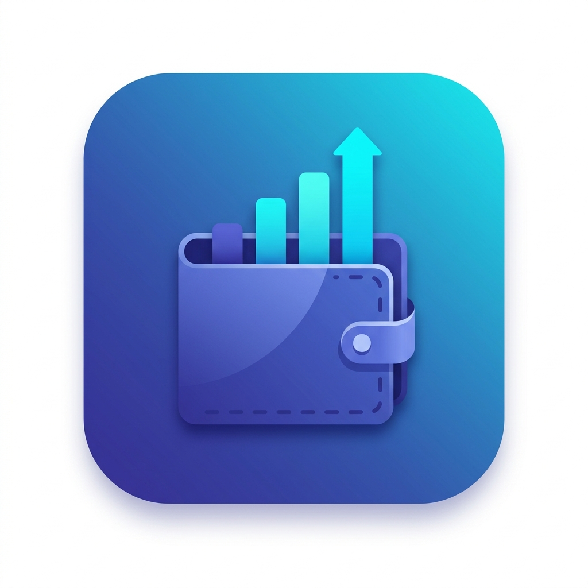

# Expense Tracker Pro

<div align="center">
  
  <p><em>A sleek, professional, and entirely private personal finance manager built with Flutter.</em></p>
</div>

---

## 📖 Project Description

**Expense Tracker Pro** is a comprehensive personal expense management application designed to help users track their daily spending, manage category-specific budgets, and gain meaningful insights into their financial habits. 

Built with an emphasis on **privacy**, **performance**, and **user experience**, all financial data is stored locally on the device. It features a responsive dashboard, intuitive analytics charts, and a dynamic theming system, ensuring an optimal experience whether you are reviewing expenses during the day or at night.

---

## 🎥 Video Demo

*(Upload your video demo here)*

---

## ✨ Key Features

- **Intuitive Expense Management**: Quickly add, edit, or remove expenses with dedicated categories (Food, Travel, Entertainment, Shopping, Bills, etc.) and date tracking.
- **Advanced Budgeting**: Set and monitor overall budgets alongside specific category limits to prevent overspending.
- **Deep Analytics & Insights**: Visualize spending patterns using dynamic charts and summaries, powered by custom expense buckets.
- **Dynamic Theming**: Seamlessly switch between light and dark modes with a provider-based theme toggle for comfortable viewing.
- **100% Offline & Private**: No cloud syncing or tracking. Everything is securely stored locally on your device via SQLite.
- **Cross-Platform Compatibility**: Built for mobile (Android/iOS) with underlying support for desktop environments during development.

---

## 🛠 Technologies & Architecture

- **Framework**: [Flutter](https://flutter.dev/) (Dart SDK >= 3.11)
- **State Management**: [Riverpod](https://riverpod.dev/) (`flutter_riverpod` ^2.6.1) - ensures scalable, decoupled, and testable state distribution.
- **Local Storage**: [sqflite](https://pub.dev/packages/sqflite) & `sqflite_common_ffi` - provides robust, structured SQL-based local data persistence.
- **Date & Formatting**: `intl` for localized date parsing and formatting.
- **Unique Identifiers**: `uuid` for generating reliable, collision-free expense records.

### Architecture Highlights
The application follows a clean, provider-driven architecture:
- **Models**: Immutable data representations (`Expense`, `ExpenseBucket`).
- **Providers**: State isolated into specific domains (`analytics`, `budgets`, `expenses`, `theme`, `filters`).
- **Database**: Dedicated repository layer (`expense_database.dart`) managing SQLite operations safely.
- **UI Shell**: Modular screen layouts routed through a central `main_shell_screen.dart`.

---

## 📂 Project Structure

```text
lib/
├── database/            # SQLite initialization and CRUD operations
│   ├── expense_database.dart
│   └── sqflite_init.dart
├── models/              # Core data classes (Expense, Category enum, etc.)
│   ├── expense.dart
│   └── expense_filter.dart
├── providers/           # Riverpod state managers (budgets, expenses, themes)
├── screens/             # Main app views
│   ├── budgets_screen.dart
│   ├── home_dashboard.dart
│   ├── insights_screen.dart
│   └── main_shell_screen.dart
├── theme/               # Light and Dark theme configurations
├── widgets/             # Reusable UI components (charts, forms, lists)
├── app.dart             # Root application widget
└── main.dart            # Application entry point
```

---

## 🔒 Privacy & Security

**Expense Tracker Pro** takes user privacy seriously:
- **No Internet Required**: The application operates completely offline.
- **Local Data Only**: Your financial data never leaves your device. We use `sqflite` to manage an encrypted-by-OS local database.
- **No Analytics Tracking**: We do not include any third-party behavioral trackers or telemetry.

---

## 🚀 Getting Started

### Prerequisites
- [Flutter SDK](https://docs.flutter.dev/get-started/install) (latest stable recommended)
- A connected device or running emulator/simulator.

### Installation

1. **Clone the repository** (if applicable):
   ```bash
   git clone <repository-url>
   cd new_expense_tracker
   ```

2. **Install dependencies**:
   ```bash
   flutter pub get
   ```

3. **Run the app**:
   ```bash
   flutter run
   ```

---

## 🤝 Contributing

Contributions are welcome! If you have ideas for new features or find a bug:
1. Open an issue to discuss your proposal.
2. Fork the repository and create a feature branch (`git checkout -b feature/amazing-feature`).
3. Ensure your code is formatted (`flutter format .`) and tests pass (`flutter test`).
4. Submit a Pull Request.

---

**License**: Please refer to the repository's `LICENSE` file for distribution terms.
